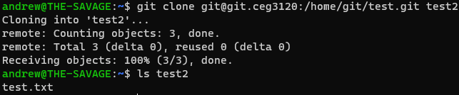

# My Project 1 (Andrew Mitchell)

## Setting up Git

These are the steps I took to set up the git server on my AWS Ubuntu system:

1. sudo adduser git
2. cd ~
3. mkdir .ssh && chmod 700 .ssh
4. touch .ssh/authorized_keys && chmod 600 .ssh/authorized_keys
5. Finally, I generated a ssh keypair on my WSL2-Ubuntu and then added the public key to the git users authorized_keys file, and set it up in my ssh_config as git.ceg3120.

## Git Usage Guide

Note: Some of these commands have many, many arguments you can supply. I've kept it to the basics.

## Clone

`git clone git@[server]:/[path] (local path)`

Git clones makes a copy of a remote repository to your local system. Local path in this command is optional, if you supply it that's where it will be stored on your local system, useful for giving it a good name.

## Init

`git init (path)`

Creates a git repository, either in the current directory, or you can specify the path.

## Add

`git add [files]`

Add new or modified files to your staging area. Can do `git add .` to add all changed/new files.

## Commit

`git commit (-m [message])`

Makes your changes in the staging area into a permanent part of the repo, so you can push it for others to use. While optional, giving commits a good message will help you in the long run.

## Push

`git push`

Sends your new commits to the central repo on the remote. Others can then pull your changes.

## Proof (screenshots)

