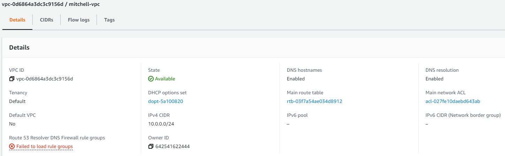
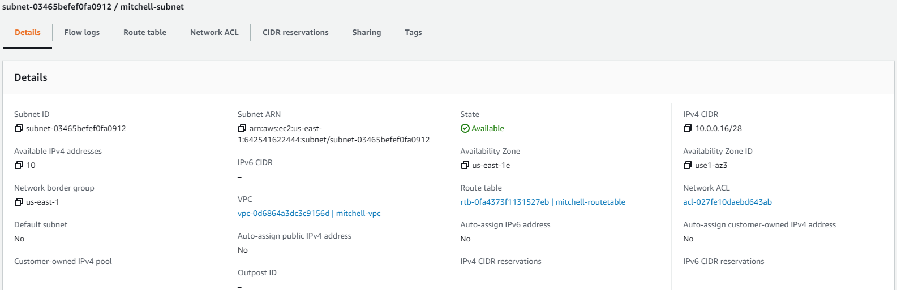
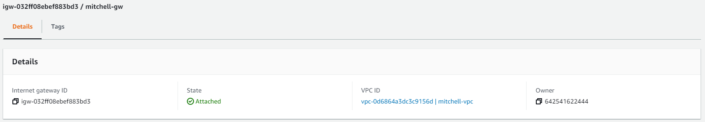
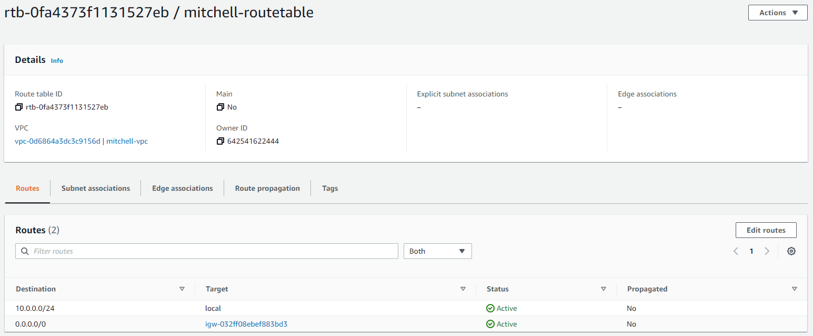
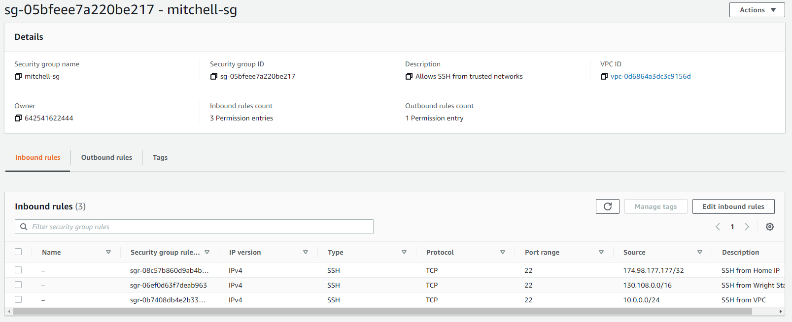
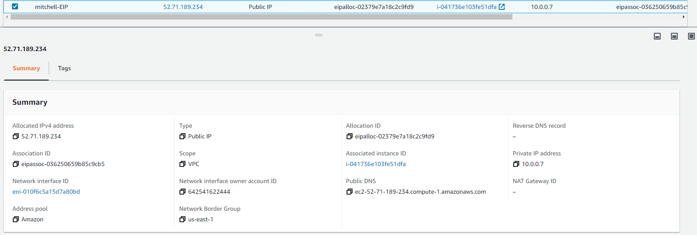
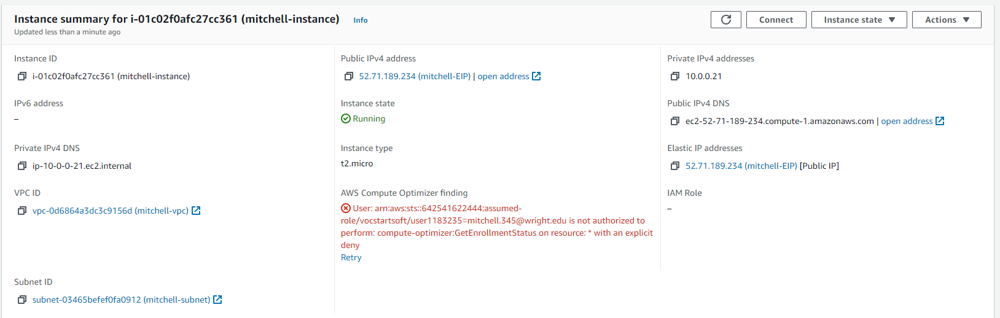
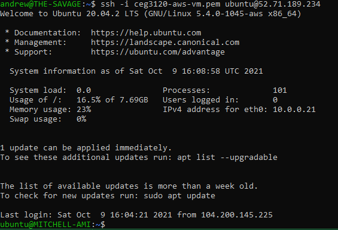

# My Project 3 (Andrew Mitchell)

## Part 1

### VPC

A virtual private cloud (VPC) is essentially a network defined in software. It allows resources to connect to each other on a private network internal to the datacenter. It's like having your own "cloud" that runs on a public cloud like AWS (hence the name private cloud).

### Subnet

A subnet defines the portion of IP space that is useable for devices in the network (and seperates the host portion from the network portion). In this case it's 10.0.0.16/28 which gives it 16 IPv4 addresses (not counting that some are taken up by AWS for other purposes, which actually reduces it to 11).

### Internet Gateway

An internet gateway is essentially a link between your VPC and devices. It performs useful tasks like Network Address Translation (NAT) and acts as a target for route tables.

### Route Table

A route table provides routes to the network. This route table consists of a route to keep internal traffic off the public internet, and another to send non-internal traffic to the internet gateway.

### Security Group

A security group is essentially a network level firewall. It enables configuring rules for inbound and outbound traffic.

## Part 2

### AMI

I chose `ami-09e67e426f25ce0d7` (Ubuntu Server 20.04 LTS x64) for my EC2 instance. Login user is ubuntu.

### Public IP

I disabled auto-assigning of an IP, and instead created an elastic IP which I then associated with the instance. This way the IP is leased to me until I decide to delete it.

### Tag

I did this during the creation of the instance, with tagname `Name` and value `mitchell-instance`.

### Volume

I created and associated this during the creation of the instance, leaving the default properties (which was an 8GB SSD volume).

### Security Group

I associated my security group during instance creation simply by selecting it.

### Instance

Here is a screenshot of my instance.

## SSH and Hostname

I changed my hostname using `hostnamectl set-hostname MITCHELL-AMI` which permanently changes the hostname. I am able to SSH into my instance.

