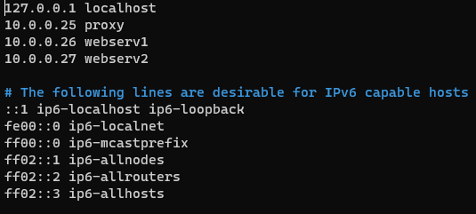
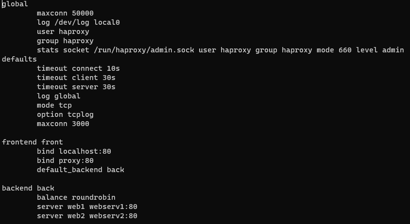
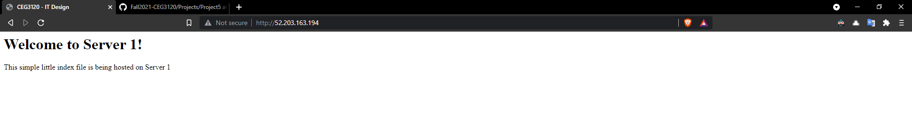

# Project 5

1. I added the following lines to `/etc/hosts`
    * `10.0.0.25 proxy` Allows using 'proxy' for the proxy server
    * `10.0.0.26 webserv1` Allows using 'webserv1' for the first web server
    * `10.0.0.27 webserv2` Allows using 'webserv2' for the second web server
    
2. First you SSH into the proxy server using it's public IP. I've used the same SSH key for all 3 servers, so then you copy your private key to the proxy server and use into the other servers via their private IPs. For example I used scp to copy the key over `scp -i "ceg3120-aws-vm.pem" ceg3120-aws-vm.pem ubuntu@52.203.163.194:~`. Then I logged into the proxy server via its public IP using `ssh -i "ceg3120-aws-vm.pem" ubuntu@52.203.163.194`. Then you can login to the other servers via their private IPs using `ssh -i "ceg3120-aws-vm.pem" ubuntu@10.0.0.26` or if configured in `/etc/hosts` you can instead substitute the hostname in place of the private IP.
3. HAProxy can be installed with `apt-get install haproxy`. The only file modified was the HAProxy config at `/etc/haproxy/haproxy.cfg`. The file was modified to look as in the screenshot.

HAProxy can be restarted with `sudo service haproxy restart` though you should validate your config first with `haproxy -c -f /etc/haproxy/haproxy.cfg` (replacing the path if yours is different). I used [https://tecadmin.net/how-to-setup-haproxy-load-balancing-on-ubuntu-linuxmint/](https://tecadmin.net/how-to-setup-haproxy-load-balancing-on-ubuntu-linuxmint/) as a resource in addition to the material presented in the lectures.
4. Nginx can be installed with `apt-get install nginx`. For each server I placed the html file (included with this repo) at `/var/www/html` as `index.html`. I left the configuration at its defaults. Nginx can be restarted with `sudo systemctl restart nginx`. I have experience with nginx so the only resource I used was for remembering the default www location [https://stackoverflow.com/questions/10674867/nginx-default-public-www-location](https://stackoverflow.com/questions/10674867/nginx-default-public-www-location).
5. Screenshots showing both servers being used:

6. [http://52.203.163.194/](http://52.203.163.194/)
